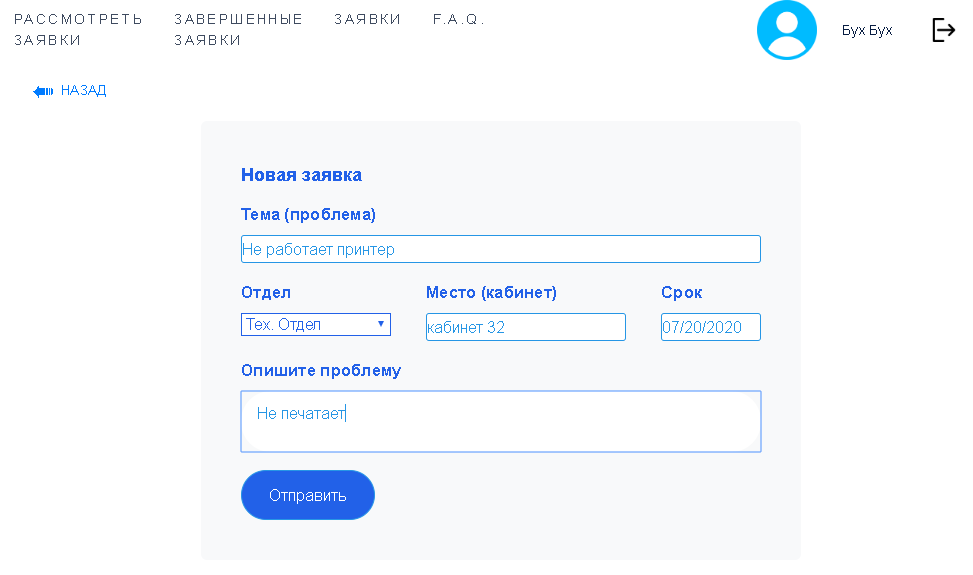
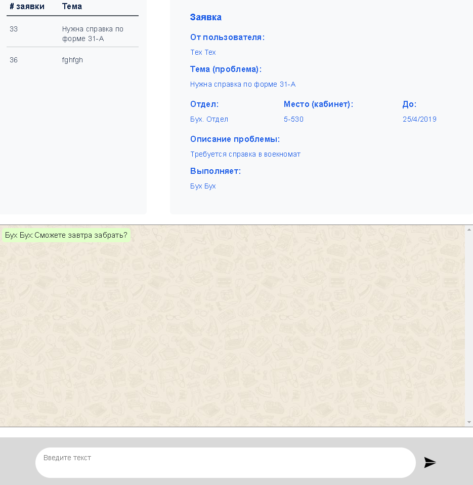

# mysite Helpdesk

A simple helpdesk web app on django framework.

Example is hosted at http://framaz.pythonanywhere.com/helpdesk/login

Accounts with different works in departments:

1. buh 1w2e3r4t
2. tech 1w2e3r4t
3. buhxtech 1w2e3r4t
4. noone 1w2e3r4t

